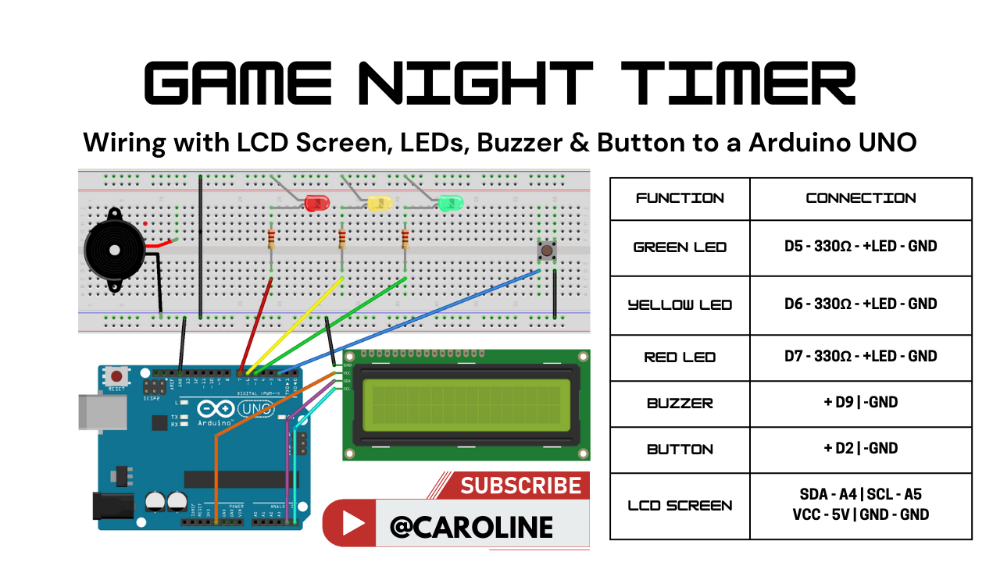

# Game Night Timer — Arduino Edition

Do your friends or family take **way too long** on their turn during board or card games?  
This project is a DIY **two-player turn timer** using an Arduino, an I²C 16×2 LCD, traffic-light style LEDs (green/yellow/red), and a buzzer.  
Think of it as a one-button **chess clock** for game night: press the button, your turn ends, and the countdown for the next player begins.

---

## Features
- One button to flip turns between Player 1 and Player 2
- **LCD 16×2 (I²C)** shows active player and time remaining
- **Green / Yellow / Red LEDs** for status:
  - Green: plenty of time
  - Yellow: running low
  - Red: nearly out
- **Buzzer tones**:
  - Start beeps (2 for Player 1, 3 for Player 2)
  - Descending alarm when time runs out
- Timeout message on LCD (“TIME IS UP – Press for next”)

---

## Hardware

- Arduino Uno, Nano (ATmega328P), or compatible
- 1 × I²C 16×2 LCD module (PCF8574 backpack at address `0x27` or `0x3F`)
- 1 × Pushbutton (wired to pin 2 with pull-up)
- 3 × LEDs (green, yellow, red)
- 3 × Current-limiting resistors (220–330 Ω)
- 1 × Piezo buzzer (on pin 9)
- Breadboard + jumper wires

**Pin mapping (default in code):**
- Button → D2 (interrupt capable)
- Green LED → D5
- Yellow LED → D6
- Red LED → D7
- Buzzer → D9
- LCD → I²C (A4 = SDA, A5 = SCL on Uno/Nano)

[Wiring Diagram](Arduino.png)



---

## Software Setup

1. **Install Arduino IDE** (https://www.arduino.cc/en/software)
2. **Install the LCD library**  
   Open **Sketch → Include Library → Manage Libraries**, search for **LiquidCrystal I2C**, and install.  
   (Tested with **Frank de Brabander’s LiquidCrystal_I2C** library.)
3. Clone or download this repository:
   ```bash
   git clone https://github.com/yourusername/game-night-timer-arduino.git
   ```
